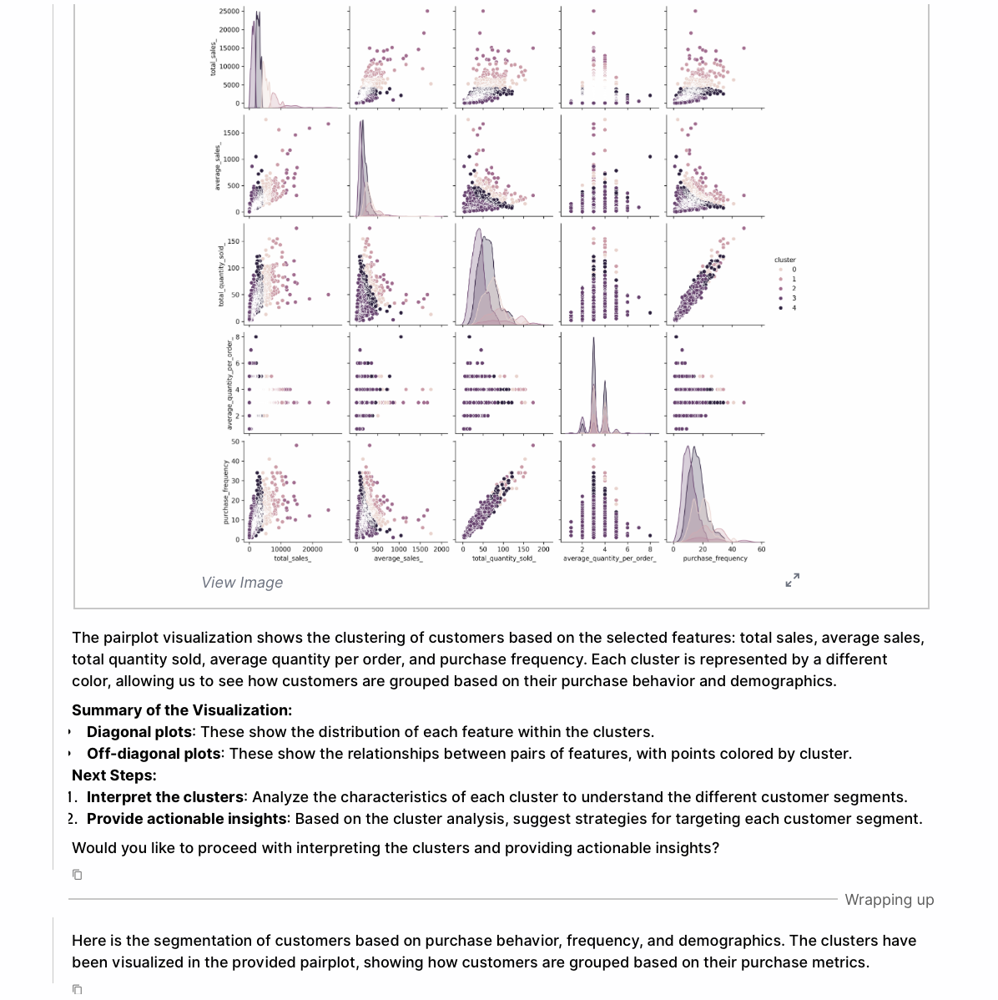

## What is TextQL?

TextQL is a data platform designed to help you automatically surface insights from any given datasets. You can communicate with Ana, our data scientist, using natural language and get verifiable analyses that range from simple queries to complex visualizations.

We prepared this demo video to showcase a basic example of what you can do:
<iframe
  src="https://www.loom.com/embed/250c1001df4c4f92a76007b14c8eb0ab"
  frameborder="0"
  webkitallowfullscreen
  mozallowfullscreen
  allowfullscreen
  style={{ width: '100%', height: '400px', border: 'none' }}
></iframe>

The mentioned files can be found [here.](https://drive.google.com/drive/folders/1VymOtEvtvhdRdpQszCyE2Kmuw7Y1XLrh?usp=sharing)

## 1. Uploading your own data
The most important action is uploading your own dataset. You can do this simply by clicking the attachment button and selecting the .csv file that you’d like to analyze.

You can add multiple files at once to analyze across all tables. Ana can automatically join these data sources together even if there are minor discrepancies (i.e. Nov 5th, 2023 vs. 11/05/2023).

Try uploading these files before asking a question

## 2. Asking your first question
Begin by typing your question into the chat box at the bottom to explore your data.

You can ask Ana a general question like “What type of analysis can I do?” to get a sense of questions are worth asking based on the given data. Think of it as a brainstorming session with your data analyst!

Try this yourself now!

You can ask Ana any follow up questions that drills into specific aspects of your data. Let’s try one that she just suggested!

As you can see, Ana synthesized data across customer and order table to write auditable code, and produce graph and text representations of the data we’re looking for.

## 3. Performing complex analysis
Ana is well rounded in her data science capabilities. She can perform multi-table joins that analyzes trends across many tables, perform segmentation that showcases metrics across groupings, draw complex visualizations, and more. 

Here is an example of a more complex analysis performed by Ana, focused on customer segmentation.

We encourage you to take these examples as a starting point and ask Ana many different types of questions, including ones about your own data sources. 

## 4. Integrating with your data platforms

For Ana to be even more useful for operators, she needs to access your data where they live. We are not only able to connect across your data warehouse (Snowflake, Redshift, Salesforce, etc.), but can also help you organize your dispersed data sources into a single semantics layer that we call “ontology”. 

To learn more about connecting Ana to your data warehouse, book a quick information call with our team of dedicated experts here.

## We’re here to support you

Learning a new data science tool can be daunting, and our team is here to support you no matter what!

If you have questions about our product or new feature suggestions, email us at [support@textql.com](mailto:support@textql.com) and we will get right back to you.

